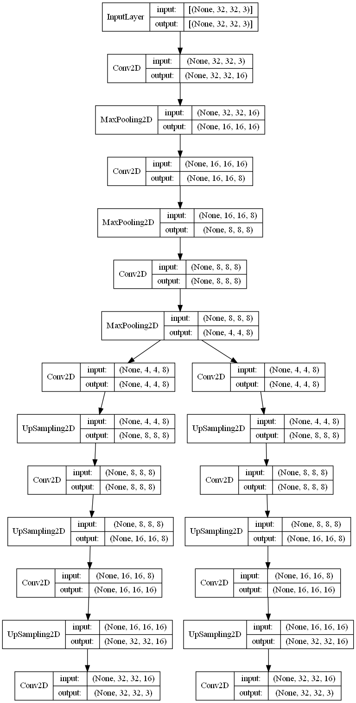
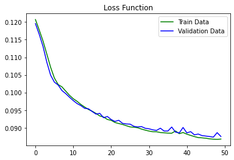

# Autoencoder Image Retrieval

Image retrieval using a simple autoencoder on CIFAR-10 dataset.

**Problem**: take 1000 images from CIFAR10. Then, given a pair of images from CIFAR10 x1 and x2, build a network that can return both images given their average (x1+x2)/2 as the only input.

## Contents
### Data Loading and Cleaning
We load the dataset from keras datasets and then normalize it.

The shape of each image is (32, 32, 3)

### Data Preparation
We need a specific sample of the dataset related to the problem.

At first, we create two image sets, each set has 1000 images, and they are supposed to be our model's outputs. The inputs of the model are the averaged images from image sets.

### Modeling
We use the following autoencoder

### Evaluation
Mean squared error is used to calculate model's loss

